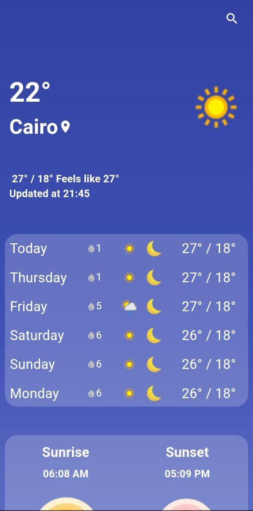
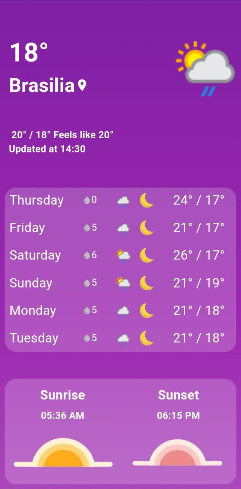

# Counter Points

A Flutter-based weather application that allows users to search for a city's weather conditions. If the city is found, the app displays the weather details; otherwise, it shows a No Weather screen.

## Features
- Search for real-time weather data by city name
- Displays weather conditions including temperature, humidity
- Error handling for invalid city names with a No Weather screen
- State management implemented using Cubit
- Integrated with a weather API for accurate data

## Technologies Used
- Flutter: For building the cross-platform mobile application
- Cubit (Bloc Package): For efficient state management
- Weather API: For fetching real-time weather information

## UI Showcase

<p align="start">
  &nbsp;&nbsp;&nbsp; 
  
</p>
<p align="start">
  &nbsp;&nbsp;&nbsp; 
  
</p>

## Getting Started

This project is a starting point for a Flutter application.

### Prerequisites
Ensure you have Flutter installed. You can check by running:
```sh
flutter --version
```

### Installation
Clone the repository and run the app:
```sh
git clone https://github.com/Nadaali18/Weather.git
cd Weather
flutter pub get
flutter run
```

### Resources
A few resources to get you started:
- [Lab: Write your first Flutter app](https://docs.flutter.dev/get-started/codelab)
- [Cookbook: Useful Flutter samples](https://docs.flutter.dev/cookbook)
- [Flutter Documentation](https://docs.flutter.dev/)

## License
This project is licensed under the MIT License - see the [LICENSE](LICENSE) file for details.

---

Feel free to contribute by submitting issues or pull requests. Any suggestions for improvement are welcome!♥